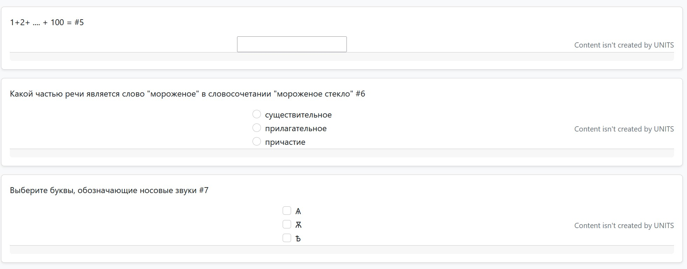

# UNITS

## Описание

UNITS - приложение для проведения тестов и опросов, состоящее
из Java-сервера и веб-клиента



## Зависимости и сборка

Используется JDK версии не меньше JDK 17

Для сборки используется Gradle в синтаксисе Kotlin

UNITS требует работы с базой данных PostgreSQL.
Для подключения к ней необходимо указать необходимые сведения
в файле `application.properties` среди ресурсов :

```toml
spring.datasource.url = ...
spring.datasource.username = ...
spring.datasource.password = ....
```
